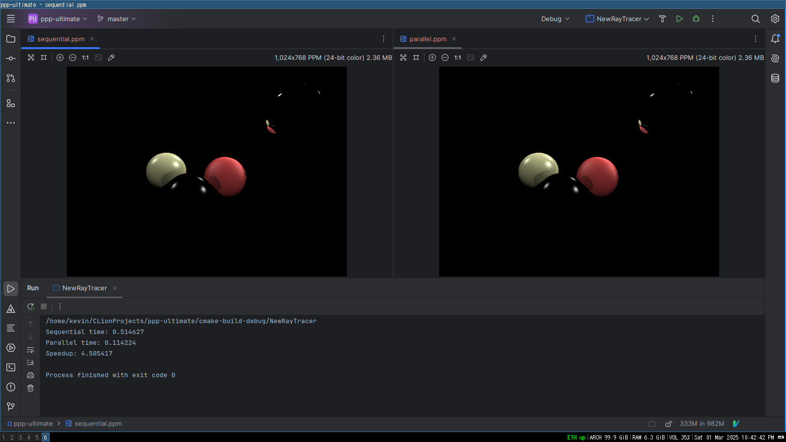

# Raytracer (Multithreading Project)

A simple, multithreaded raytracer, featuring global ilumination, shadows and reflections.

This raytracer uses the CXX standard library. It provides two versions:

- A standard, sequential version.
- A threaded version, making use of std::jthread.

## Build

```
$ mkdir build && cd build
$ cmake ..
$ make
```

## Results


